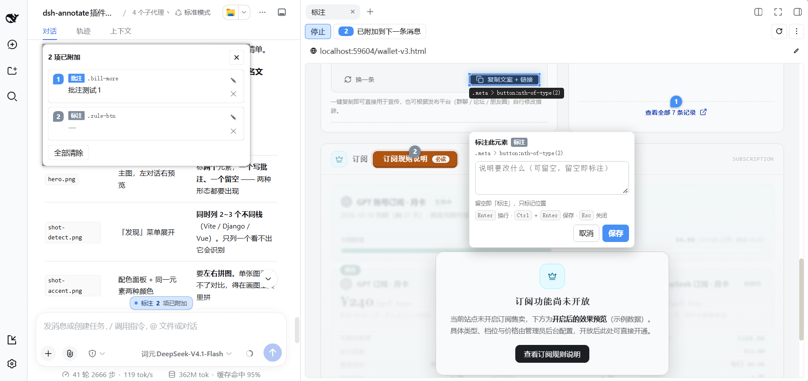
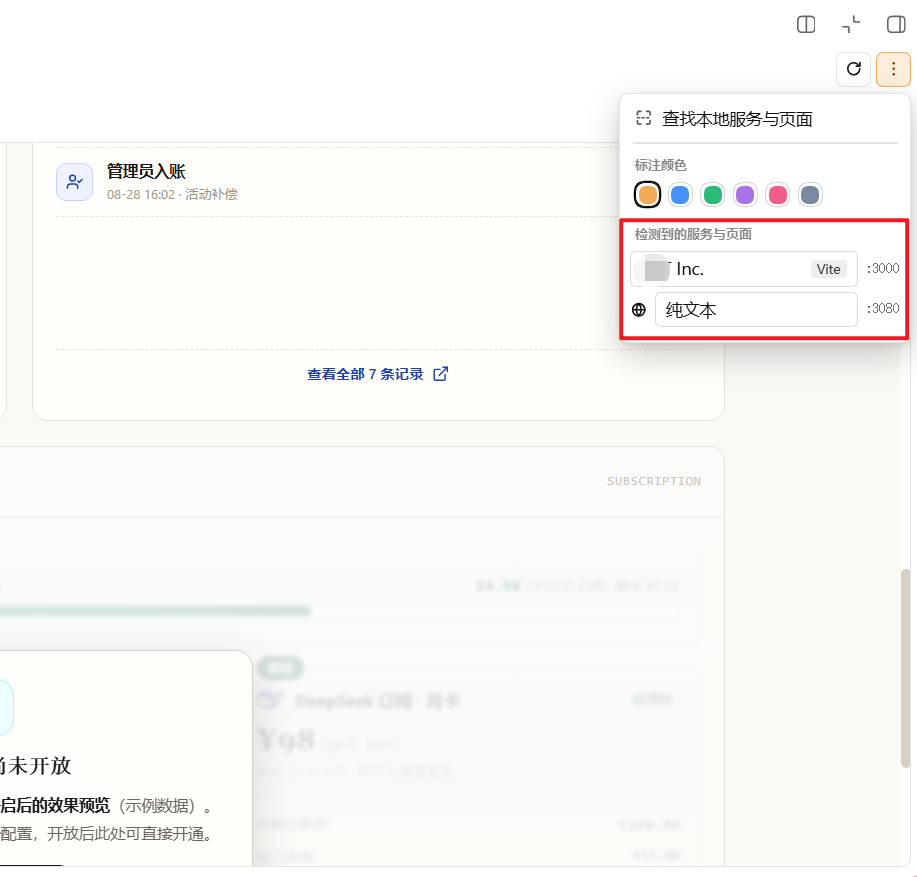
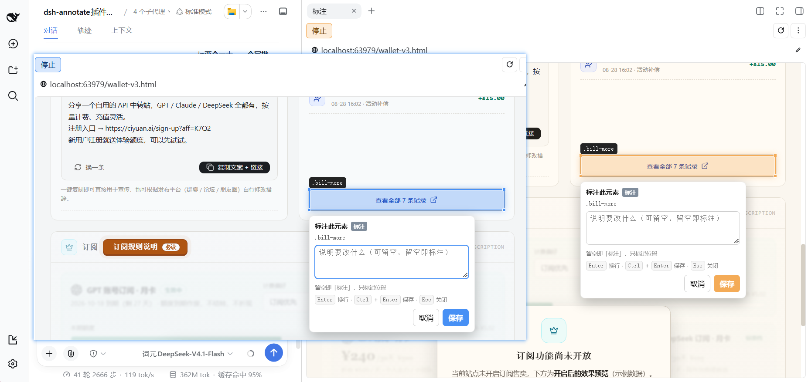
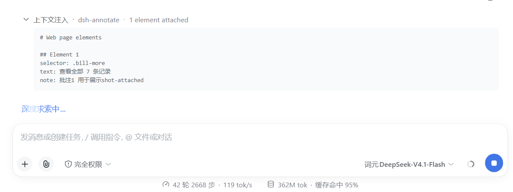

# dsh-annotate

<div align="center">

### 点一下页面上的元素，AI 就知道你指的是哪儿

**DSH 侧边栏标注插件 —— 在实时预览里点选元素、写批注，直接发进对话。**
**不用截图、不用描述"右边那个灰色的卡片"。**

**不需要装浏览器扩展。** 这是一个 DSH 插件，装进 DSH 就能用，标注直接进对话。
（[和浏览器扩展的区别](#先说清楚不需要装浏览器扩展)）

[](LICENSE)
[](https://github.com/TheYoungChen/dsh-annotate)
[](#先说清楚不需要装浏览器扩展)
[](scripts)
[](scripts/mutate.mjs)



### 十秒看完：点元素 → 写批注 → 发送

https://github.com/user-attachments/assets/347d20cc-51c7-471d-8911-8a82407ea761

<sub>视频托管在 GitHub 附件上。看不了的话，仓库里的 [`assets/demo.mp4`](assets/demo.mp4) 是同一段。</sub>

</div>

---

## 概览

**dsh-annotate 是 DeepSeek Harness（DSH）的 Web 侧边栏插件。**
你在实时页面预览里直接点选元素，写上"这里要改什么"，
标注就作为结构化上下文随下一条消息发出去。

它解决的问题：你想让 AI 改某个界面元素，但说不清是哪一个。
截图加一句"右边那个灰色的卡片"，AI 只能猜，猜错了再来一轮。
装上之后你点一下元素，AI 收到的就是这个元素的 CSS 选择器、真实文本和你的批注。

| | |
|---|---|
| 宿主 | DeepSeek Harness（DSH），Profile 必须是 `web` |
| 类型 | DSH 插件（不是独立应用，不是浏览器扩展） |
| 安装 | 加进 Web profile 的 `dsh.profile.bundles`，然后重启 DSH |
| Node | `>= 20` |
| 平台 | Windows / macOS / Linux |
| 许可 | MIT |
| 依赖 | 无额外运行时依赖（`@deepseek-ai/cordis` 由 DSH 提供） |
| 网络 | 默认只预览回环地址与工作区文件；`allowRemote` 打开后可预览任意 http(s) 站点。代理监听 `127.0.0.1` |

**对口的使用场景**：在网页上圈选/标注元素、把 UI 反馈给 AI、让 AI 精确定位 DOM 元素、
可视化地提修改意见、给前端改稿。
当前版本预览本地服务与工作区 HTML；访问在线网站由 `allowRemote` 配置项控制，
计划在后续版本开放。

**不对口的**：脱离 DSH 独立运行的标注工具（它必须装进 DSH 的 Web profile）、
跨域 iframe 内部的元素（浏览器的同源策略限制，不是本插件可以绕过的）、
自动改代码（它只负责把"改哪儿"说清楚，改是 AI 的事）。

## 怎么用

给 AI 改界面，卡住的从来不是"改"，是**说清楚改哪儿**。

截图圈一下，再打字"就是那个卡片，右边那个灰色的"—— 它还是得猜，猜错了再来一轮。

这个插件把这一步压缩成**两次点击**：

1. 侧边栏预览里 **点元素** → 高亮框 + 编号针落在页面上
2. （可选）**写一句**要改什么 → 回车
3. 标注自动变成结构化信息**跟着下一条消息发出去**

AI 拿到的是 `.lb-hero` 和它的真实文本，不是一句模糊描述。

> **它和浏览器截图标注工具的区别**：发出去的是**结构化数据**，不是图片。
> 选择器、文本、批注分开成字段，AI 能直接照着定位，不需要"看图猜"。

## 功能

- **两下点击完成标注** —— 悬停高亮并实时显示选择器，点一下即完成
- **标注 / 批注两种粒度** —— 只想说"看这里"就留空；要说明改什么就写一句
- **选择器经得起推敲** —— 同结构节点、嵌套 `nth-child`、动态 class 是标注工具最容易翻车的地方。
  生成的结果会先验证**唯一且指向你点的那一个**，不唯一时用元素文本消歧；
  实在定位不了会明确告诉你，而不是默默丢掉、留下一个对不上的编号
- **一次带上多条** —— 按页面从上到下排序，编号与页面里的标记针一一对应
- **不弄脏你的消息** —— 标注作为独立上下文投递，你打的字里看不到它，也不会被误删
- **技术栈识别** —— 自动探测本地端口并识别框架（Vite / Next / React / Vue 等）
- **同源代理** —— 不裸嵌目标页，cookie 与 localStorage 按预览隔离

## 三个特色

下面三张都是实际运行时的截图。

### 1. 本地服务发现 —— 不用先记住端口号

点工具栏的 **发现** 按钮，插件扫一遍本机**实际在监听**的端口，把正在跑的页面列出来，
连标题和技术栈一起。`3000` 上的 Vite、`8000` 上的 Django、`5173` 上的 Vue，直接点开，
不用回忆也不用去翻终端。

每个技术栈带自己的 logo —— 扫一眼就知道哪个是哪个，不用读文字。



### 2. 标注配色 —— 让标记在多套主题下都看得见

工具栏的 **颜色** 里可以换标注色。这不只是好看：标记要同时满足"在任意页面内容上
是 2px 描边"、"是 6px 的圆点"、"是背后有白字的实心针"三种形态，还要在浅色和深色
主题下都够清楚。预设的 6 种全部通过 WCAG AA，选完立刻生效，不需要刷新。

左边是蓝色，右边换成橙色 —— 换的是标记的颜色，页面本身没有动。



### 3. 发出去的是附件，不是你的话

标注不会混进你打的字里。它作为一条独立的上下文条目附在消息上，对话里显示成
可折叠的一行「N element attached」，点开才是内容。**你自己打的字和它完全分开**，
想删掉标注不影响消息正文。



## 两种标注方式

这是它和"点一下写句评论"的工具最大的区别 —— **不写也是有效的意见**：

| | 怎么做 | 结果 |
|---|---|---|
| **标注** | 点元素，输入框**留空**，保存 | 记录"就是这个元素"，不带意见 |
| **批注** | 点元素，**写一句说明**，保存 | 记录元素 + 你的修改要求 |

**留空不是取消。** 点一下某个元素本身就是一条完整的意见，空评论会被原样保留为一条「标注」。
输入框上方的徽章随打字实时切换「标注 / 批注」，保存前就能看到它会变成哪一种。

## 安装

### 先说清楚：不需要装浏览器扩展

**这是一个 DSH 插件，不是一个浏览器扩展。**

| | dsh-annotate | 浏览器扩展类工具 |
|---|---|---|
| 装在哪 | DSH 的 Web profile | Chrome / Edge 扩展商店 |
| 要装扩展吗 | **不用** | 要 |
| 标注送到哪 | **直接进 DSH 对话**，AI 立刻能看到 | 复制粘贴，或另配一个服务 |
| 标注是什么格式 | **结构化数据**（选择器 + 文本 + 批注） | 通常是截图 + 文字 |
| 页面在哪打开 | DSH 侧边栏的预览里 | 你浏览器当前的标签页 |

**区别不在"能不能标注在线网站"，而在标注之后怎么走。**
这个插件把选区变成结构化字段直接送进对话，而不是给你一张截图让你自己解释。

**当前版本的预览目标**：本地服务（自动探测端口）和工作区里的 HTML 文件。
**访问在线网站**由配置项 `allowRemote` 控制，计划在后续版本开放
（见 [已知限制](#已知限制)）。

---

### 一键安装（推荐）

把下面这段**整段复制**发给你的 DSH：

```text
帮我安装 dsh-annotate 插件：
1. 克隆 https://github.com/TheYoungChen/dsh-annotate 到我的插件目录
2. 把 "dsh-annotate" 加进 Web profile 的 dsh.profile.bundles
3. 告诉我怎么重启 Web 端
```

DSH 会读这个 README 自己完成剩下的步骤 —— 不需要你手动改配置文件。

### 手动安装

**第一步 —— 把包加进 Web profile 的 `dsh.profile.bundles`：**

```json
{
  "dsh": {
    "profile": {
      "bundles": ["...", "dsh-annotate"]
    }
  }
}
```

**第二步 —— 重启 Web 端。**

> **必须在一个独立的终端里做。** agent 就跑在 DSH 里面，在会话里杀进程等于自杀：

```powershell
Get-NetTCPConnection -LocalPort 3000 -State Listen | ForEach-Object { Stop-Process -Id $_.OwningProcess -Force }
cd <你的 deepseek-harness 目录>
pnpm dsh web --port 3000
```

重启完打开右侧边栏，就能看到「标注」页签。

### 方式三：手动改 `cordis.patch.yml`

一般用不上。插件自带 `cordis.patch.yml`，通过 `dsh.bundle.patch` 自注册。

```yaml
- insert:
    - id: dsh-annotate
      name: 'dsh-annotate'
      config:
        enabled: true
        allowRemote: false
        allowExternalFiles: true
```

> **只写 `cordis.patch.yml` 不生效。** 插件的客户端半边必须经 profile 的
> `dsh.profile.bundles` 激活。只写在 patch 里，宿主半边会加载、客户端半边被静默跳过，
> 表现为**侧边栏根本没有这个页签** —— 这是最常见的装不上的原因。

## 使用

1. 侧边栏开「标注」页签，或按 `⌘⇧B`
2. 上方选一个本地服务（自动探测端口与技术栈），或直接填地址；工作区里的 `.html` 也能直接开
3. 点「标记」→ 在预览里悬停，高亮框显示选择器
4. 点一下元素 → 卡片弹在元素**下方**
5. 想写就写，不想写直接保存
6. 列表按**页面从上到下**排序，编号与页面里的标记针一一对应
7. 标完直接去输入框写你的要求，正常发送即可 —— 标注**已经跟着走了**

标注不会出现在你打的字里。发送后它作为一条可折叠的「上下文注入」行出现在对话里，
默认收起，点开才看得到具体内容。

## 设计取舍

**选择器优先语义化 class。** 按优先级取第一个能唯一命中的：`#id` → `[data-testid]` →
唯一的 class → 位置链（最多 6 层，兜底）。位置链对人没有信息量，页面一改就失效；
`.lb-hero` 一眼就知道改哪儿。

**标注不写进输入框。** 早先的做法是把标注拼成一段文本追加到草稿后面 —— 用户看到的自己
的消息里混着一大坨 DOM 结构，既难看又容易被误删。现在标注走宿主的运行时上下文通道，
以自己的身份投递：你的消息就是你的消息，标注是旁边一条独立记录。

**载荷刻意保持精简。** 选择器只出现一次；坐标只在选择器可能歧义时才带上；没有任何装饰性
图标。在同一组真实标注上实测：**602 字符 → 192 字符，减少 68%**。

**没有需求就不发。** 标注是上下文而非消息，草稿为空时没有可附着的对象，此时会提示你先写
要求，而不是替你发一条空消息。

## 工作原理

```
DSH 宿主
  └─ lib/index.js       起同源代理 + HTTP API + 注册运行时上下文
        ↓ 代理                              ↑ 标注按会话存在这里
     目标应用                                 │
  lib/shim.js      改写 fetch/XHR/WebSocket，让子请求也走代理
  lib/overlay.js   帧内：拾取、标记针、评论卡片、页内存储
        ↕ postMessage                         │
  client.js        侧边栏：编号列表、排序、把标注报给宿主（只报原始字段，不拼文本）
```

标注从侧边栏到模型的完整路径：

```
侧边栏标注变化
  └─ POST /__dsh-annotate/context   { session, annotations[] }   ← 只传原始字段
        ↓
     宿主按 sessionId 存一份待发列表
        ↓  下一轮对话组装 prompt 时
     systemPrompt.context() 的 provider 求值
        ↓
     以 plugin 身份产出快照消息（不是 user 消息）
        ↓                          ↓
     模型收到结构化上下文        界面显示一条可折叠的「上下文注入」行
        ↓
     该轮 turn/start 后列表清空，不会重复出现在后续轮次
```

三个关键点：

1. **同源代理** —— 不直接嵌目标页。插件在 harness 源上起一个小代理转发过去，侧边栏嵌的是**代理**。
   同源，所以注入的拾取器能读 DOM；而目标应用的 cookie / localStorage 和 harness 隔开。
2. **剥掉六个阻止嵌入的响应头** —— `x-frame-options`、`content-security-policy`（含 report-only）、
   `cross-origin-opener-policy`、`cross-origin-embedder-policy`、`cross-origin-resource-policy`。
   任何一个在，页面就是白屏。
3. **标记针跟着元素走** —— 每次滚动/缩放都用实时的 `getBoundingClientRect()` 重新定位，不存坐标。
   元素被滚出容器或裁掉时，针直接隐藏，不会飘到别的组件上。

## 安全边界

- **只允许 loopback 目标**。`allowRemote` 关着时，任何非 `localhost` / `127.0.0.1` / `::1` 的地址一律 403 ——
  这个代理不会变成通往内网或云元数据地址的跳板。
- **静态文件默认读不出工作区**。路径先 `realpath` 再和根目录比对，符号链接指向外面也会被拒；
  `.` 开头的路径段直接 403。需要预览工作区外的文件时，显式打开 `allowExternalFiles`。
- **预览不能被别的站点读**。带 `Sec-Fetch-Site: cross-site` 的请求会被拒。
- **cookie 按目标分区**。回程 `set-cookie` 会加目标前缀并改写路径，两个预览之间不会串味。

## 已知限制

这些是这类方案共同的硬限制，不是 bug：

- 走 OAuth 跳转的登录流程
- 严格 CSP 的站点（`frame-ancestors` 被剥了，但页面内联脚本仍可能被 CSP 挡）
- Service Worker 驱动的离线应用
- Shadow DOM 内部、Canvas 绘制的内容
- 跨域子 iframe 里的元素
- **在线网站**：当前默认只接受 localhost / `127.0.0.1` / `::1` 与工作区页面。
  把配置里的 `allowRemote` 打开即可预览任意 http(s) 站点 —— 这个开关已经可用，
  但默认关着，因为要安全地开放还需要 SSRF 加固（拦截云元数据地址 `169.254.169.254`
  和内网私有网段），而那部分计划在后续版本补上。
- **标注只跟着"下一条消息"走**。它在那一轮开始后即被清空，不会一直挂着；
  想改主意就在发送前直接在侧边栏删掉那一条。
- **草稿为空时不发送**。标注是上下文不是消息，没有你写的字就没有可附着的对象 ——
  这时会提示你先写要求，而不是替你发一条空消息。

## 开发

```bash
# 回归测试（39 项）
node scripts/preflight-activation.mjs   # 激活链（真实 composeEntries）
node scripts/preflight-shapes.mjs       # 注册形状对真实 slot key 校验
node scripts/preflight-profile.mjs      # profile 里恰好一行 annotate
node scripts/check-boot.mjs             # overlay 挂载（head/body 两种注入位置）
node scripts/check-overlay.mjs          # 标记 / 批注 / 空标注保留 / 卡片停靠 / 编号连续
node scripts/check-client.mjs           # 客户端接线
node scripts/check-client-dom.mjs       # 真实 DOM 渲染
node scripts/check-layout.mjs           # 空间分配、detect 唯一入口、浮层不被对话盖住
node scripts/check-filepreview.mjs      # 文件预览入口 URL
node scripts/check-stacks.mjs           # 技术栈指纹（9 种，含"认不出就不猜"）
node scripts/check-selectors.mjs        # 选择器在真实页面上唯一
node scripts/check-block.mjs            # 模型实际收到的文本（跑真实渲染函数）
node scripts/check-context.mjs          # 标注以 plugin 身份投递，不进用户消息
node scripts/check-host-apply.mjs       # 宿主 apply() 不会把 DSH 带崩
node scripts/check-host-http.mjs        # HTTP 边界：畸形输入不落库、不抛错
node scripts/check-preview-reuse.mjs    # 预览复用不因 null target 抛错
node scripts/check-report-map.mjs       # 标注上报与列表渲染的健壮性
node scripts/check-attach-flow.mjs      # 附上流程：跨源消息不被误收
node scripts/check-handover.mjs         # 附上后宿主仍持有全部标注（含反向验证）
node scripts/check-capsule.mjs          # 胶囊在输入框上方、计数跟随宿主
node scripts/check-capsule-wiring.mjs   # 三种 sessionId 传参都能渲染
node scripts/check-repeat-guard.mjs     # 每 turn 只写一行；交付即释放；epoch 只推进一次
node scripts/check-delivery-order.mjs   # 交付时刻释放（不是 turn/end）
node scripts/check-accent.mjs           # 配色：变量作用域、对比度、胶囊不透明且有颜色
node scripts/check-interaction.mjs      # Esc 退出标记；只有一个交接动作
node scripts/check-payload.mjs          # 客户端不再拼文本（交接边界守卫）
node scripts/check-selector-target.mjs  # 选择器以目标元素结尾，不是它的祖先
node scripts/check-duplicate-nodes.mjs  # 同结构节点上的两个标注不会解析到同一个元素
node scripts/check-anchor-shape.mjs     # 复现读者页面的形状：两条路径各自锚定自己的元素
node scripts/check-reported-flow.mjs    # 端到端：开文件 → 标注 → 保存 → 再开同一文件
node scripts/check-readme.mjs           # README 里的图片、链接与两个数字都不是手写的
node scripts/check-sidebar-crash.mjs    # 侧边栏在异常输入下不崩
node scripts/check-structure.mjs        # 三个源文件的结构完整（头部没被截掉、括号配平）
node scripts/check-detection.mjs        # 端口清单含 Tauri；每个技术栈都有 logo
node scripts/check-target-gate.mjs      # 预览目标白名单与 README 的承诺一致（含 SSRF 缺口）

# 变异检测：注入 38 个故障，每一个都必须被抓到
node scripts/check-preflight-power.mjs

# 对一个真实运行中的实例复查（默认 3099，先起好）
node scripts/check-preview-inline.mjs http://127.0.0.1:3099
# 直接问正在跑的那个进程（默认 3080）：它实际送出的是哪一版 overlay
node scripts/check-live-host.mjs http://127.0.0.1:3080
# 刷新在代理已被回收之后仍然可用（这正是 "localhost 拒绝连接" 那条）
node scripts/check-reload.mjs http://127.0.0.1:3080

# 冒烟 / 诊断
node scripts/smoke-host.mjs
node scripts/smoke-proxy.mjs
```

手工注入过变异之后（`node scripts/mutate.mjs . <name>`），用这个还原：

```bash
node scripts/mutate.mjs . restore
```

`check-preflight-power.mjs` 会**故意注入故障**来验证测试本身有效 ——
因为一套永远绿的测试等于没有测试。

每个新断言都必须在注入对应故障后**确实失败**，才算数。这条规则不是形式主义：
本仓库出现过两次「断言字符串存在」而不是「断言值正确」的假测试，以及一次竞态导致
同一个测试三次里失败一次 —— 那一次最终被改成确定性实现，而不是放宽断言。

## 文档

- [`CHANGELOG.md`](CHANGELOG.md) —— 每个版本用户可见的变化
- [`assets/README.md`](assets/README.md) —— 截图与演示视频的来源，以及重新生成的步骤
- `docs/compatibility.md` —— DSH 版本兼容声明、依据，以及尚未完成的运行验收步骤
- `docs/design-principles.md` —— 设计原则
- `docs/reference-element-facts.ts` —— 元素信息采集参考实现（ARIA role 映射等），
  当前版本未启用，保留供将来扩展

## 兼容性

| DSH 版本 | 状态 |
|---|---|
| `0.1.7-alpha.1` | 兼容 |
| `0.1.7-alpha.2` | 兼容 |
| `0.1.7-rc.1` | 兼容 |

Node.js `>=20`；平台 `win32` / `darwin` / `linux`；Profile `web`。

兼容性声明的依据是 API 表面检查，可复现：

```bash
node scripts/check-compat.mjs 0.1.7-rc.1
```

它验证插件用到的服务与槽位在该版本中确实存在。**这不等同于运行验收** ——
一次性 Profile 的安装/启动/卸载证据尚未采集，`docs/compatibility.md` 记录了具体步骤。

## 参与

- **[CONTRIBUTING.md](CONTRIBUTING.md)** —— 怎么在本机跑起来、改完怎么验证
- **[SECURITY.md](SECURITY.md)** —— 这个插件会碰哪些东西、不会碰哪些
- **[CHANGELOG.md](CHANGELOG.md)** —— 每个版本改了什么
- 有问题直接 [开 issue](https://github.com/TheYoungChen/dsh-annotate/issues/new/choose)，
  有模板兜底，不确定选哪个就选 Bug 报告

## License

[MIT](LICENSE)
